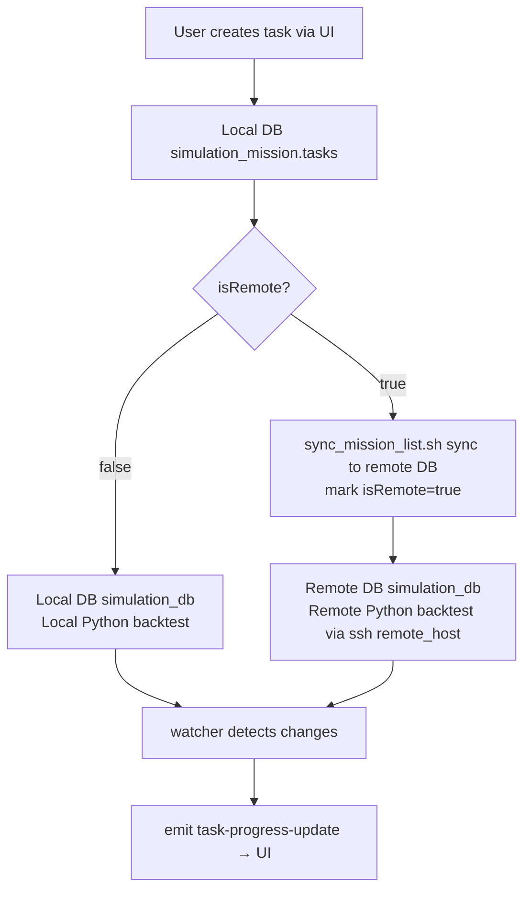

# QuantNight Task Manager

[中文](./README.md)


[](https://vuejs.org/)
[](https://tauri.app/)


QuantNight is a desktop application designed for quantitative research and simulation, aimed at helping you efficiently manage, execute, and analyze various quantitative tasks.

---

## Core Features

- **Unified Task Management**: View all normal, priority, and super tasks in one clear interface.
- **Flexible Task Creation**: Quickly create new tasks from templates, with support for local or remote execution.
- **Convenient Task Operations**: Start, pause, update, or delete tasks with a single click.
- **Data Visualization and Analysis**: Built-in data browser with support for filtering, sorting, and correlation analysis of result sets.
- **Graphical Application Configuration**: Easily manage all key frontend and backend configurations through the settings interface, no manual file editing required.

---

## System Architecture

> ⚠️ **The most important section for developers/agents.** Quantitative backtesting is a **state-driven distributed system**: the UI is decoupled from execution, and data flows across databases. **"Local/Remote" is NOT a fixed machine — it is a concept configured through Settings.** Any deployment shape (single machine, dual machine, remote) is expressed via configuration. Never hardcode machine names or paths.

### 1. Configuration-Driven "Local/Remote" Model

| Config Key | Location | Meaning |
|---|---|---|
| `mongodb.local_uri` | Settings / config.toml | Local DB URI (default `mongodb://localhost:27017`) |
| `mongodb.remote_uri` | Settings / config.toml | Remote DB URI (via SSH tunnel, e.g. `mongodb://127.0.0.1:27018/?directConnection=true` = mac-mini execution machine) |
| `env.working_dir` | Settings / config.toml | Working directory for backend Python scripts |
| `scripts.local_workdir` | credentials.yaml | Local working directory |
| `scripts.remote_host` / `remote_workdir` | credentials.yaml | Remote execution host and directory |

- Single-machine: `remote_uri` points to the local host or empty; `isRemote` stays `false`.
- Dual-machine (recommended): the desktop app handles UI/task management; an execution machine (e.g. mac-mini) runs Python backtests; `remote_uri` / `remote_host` point to it.

### 2. Dual-Database Model

The app holds **local** and **remote** MongoDB clients simultaneously (`MongoClients { local, remote }`), dispatching by each task's `isRemote` field:

| Database | Content | Read/Write Location |
|---|---|---|
| `simulation_mission.tasks` | Task config & status (**single source of truth**) | **Always local DB** |
| `simulation_db.<task>` | Simulation items (settings/regular/feat/results) | Dispatched by `isRemote`: local or remote DB |
| `alpha_db` | Core alpha results / PnL / platform data | Local DB |

### 3. Task Data Flow



1. **Create task** → write local `simulation_mission.tasks` (frontend task list reads from here).
2. **Generate list** → run `mongo_datum` locally (template generates items into `simulation_db.<task>`, **always written to the local DB first**).
3. **Send to remote** (optional, for isRemote tasks) → `sync_mission_list.sh` pushes `simulation_db.<task>` to `remote_uri`, then mark `isRemote=true`.
4. **Start task** → `start_task.sh <name> <config> <isRemote>`:
   - `isRemote=false`: start Python locally.
   - `isRemote=true`: start Python on `remote_host` via SSH (reads remote DB).
5. **Backtest execution** → Python reads items from the corresponding DB → submits WQB simulations → writes results back to the same DB.
6. **Progress push** → the frontend `watcher` listens to changes on **both** `simulation_db` (local + remote) via ChangeStream, picks the DB by the task's `isRemote`, and `emit("task-progress-update")` to the UI.

### 4. Frontend Data Source Cheat-Sheet (for agents debugging)

| UI Content | Command / Mechanism | DB Read |
|---|---|---|
| Task list / status | `get_all_tasks` | Local `simulation_mission.tasks` |
| Task card ✓/✗/Σ progress | `watcher.rs` ChangeStream + `emit_progress_for_collection` | **Dispatched by isRemote**: true→remote, false→local |
| Data analysis (Data page) | `datas.rs` queries | Local `simulation_db` / `alpha_db` |
| isRemote toggle | `update_remote_status` | Updates local tasks doc |

### 5. `isRemote` Semantics

- `false` (local): data in local DB; Python executes locally.
- `true` (remote): data synced to remote DB; Python executes remotely (SSH).
- ⚠️ Toggling `isRemote` only changes the task doc field — it does **NOT** move data automatically. You must run `sync_mission_list.sh` first, then mark `isRemote`.

### 6. Script Execution Model

UI button → Tauri `invoke` command → `run_bash_script` / `run_python_command` (mapped by `python.scripts` / `bash.scripts`) → execute shell/uv locally, or via SSH to `remote_host`. **Task execution logic lives in the backend repo (quantnight), not in this repo.**

---

## First-Time Use and Configuration

Before you begin, please ensure your environment is configured correctly.

### 1. Environment Setup

- **MongoDB Database**: The application needs to connect to a running MongoDB instance. Please ensure the following three databases have been created in the instance:
  1.  `simulation_mission`
  2.  `simulation_db`
  3.  `alpha_db`
- **Create `tasks` Collection**: In the `simulation_mission` database, you **must** manually create an empty collection named `tasks`, otherwise the application will not start correctly.

### 2. Configuration Management

The application provides a complete graphical configuration interface, so you don't need to edit any configuration files manually. On first launch, the application will automatically create the necessary configuration files.

- **All configurations can be done through the UI**:
  - Frontend config (template paths, data filter options, etc.)
  - Backend config (MongoDB connections, Python interpreter path, etc.)
  - Script mapping config

- **Config file locations**:
  - User data directory (preferred)
  - App resource directory (fallback)

> **Note**: Frontend config changes take effect immediately; backend config changes require an app restart.

---

## Usage Guide

### Task Manager

This is the main interface where you can see the list of all created tasks.

- **View tasks**: The list shows task name, type, status, etc.
- **Operate tasks**: Each task card provides `Start` / `Pause` / `Delete` action buttons.
- **Task card progress**: Cards show `✓ success | ✗ failed | Σ total` (format: `normal+priority`). Progress is pushed by the watcher in real time; for isRemote tasks it shows the **remote DB** status.

### Creating New Tasks

Click the `+ Add Task` button in the top right corner to create one of three task types:

- **Add Task**: Creates a regular quantitative task.
- **Add Super Task**: Creates a super task for more complex combinations or workflows.
- **Add Priority Task**: Creates a high-priority task.

In the dialog, enter a task name and select a template file. On start, you can set task parameters in the "Config JSON" (e.g. the `adaptive` adaptive-scheduling config).

### Data Analysis

Switch to the `Data` page to analyze results in depth.

- **Select result set**: Choose a data collection from the dropdown (e.g. `alpha_results`).
- **Use filters**: Filter data with the filter boxes (ID, Region, Turnover, etc.).
- **Compute correlation**: After filtering, click `Compute Correlation` to run correlation analysis.

### Settings

Click the gear icon `⚙️` to open the settings panel:

- **Frontend config**:
  - **Template Paths**: Set the folder paths for template files used to create different task types.
  - **Data Filter Options**: Customize the result-set dropdown options on the Data analysis page.

- **Backend config**:
  - **MongoDB Settings**: Configure local and remote connection strings (`local_uri` / `remote_uri`) and database names.
  - **Python Settings**: Set the Python interpreter path and working directory.
  - **Script Mapping**: Manage button-to-script mappings, with support for custom scripts.

> **Note**: Backend config changes require an app restart.

---

## Installation

### macOS

1.  **Download**: Get the latest `.dmg` from the Releases page.
2.  **Install**: Open the `.dmg` and drag `QuantNight.app` into `Applications`.
3.  **Security notice**: If macOS says the app is damaged or can't be opened, run:
    ```bash
    sudo xattr -r -d com.apple.quarantine /Applications/QuantNight.app
    ```

### Windows

1.  **Download**: Get the latest `.msi` installer from the Releases page.
2.  **Install**: Run the `.msi` and follow the wizard.
3.  **Security notice**: If Windows SmartScreen blocks it, click `More info` -> `Run anyway`.
