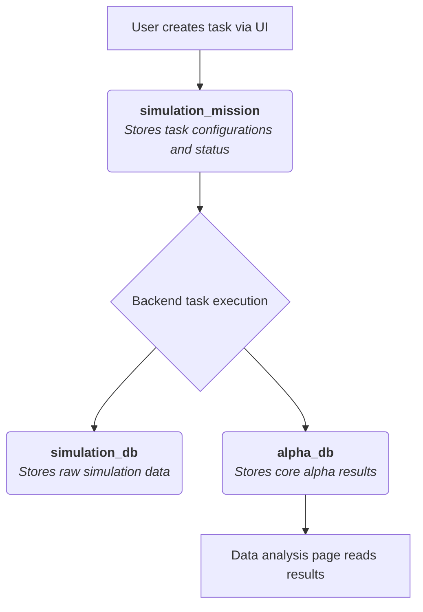
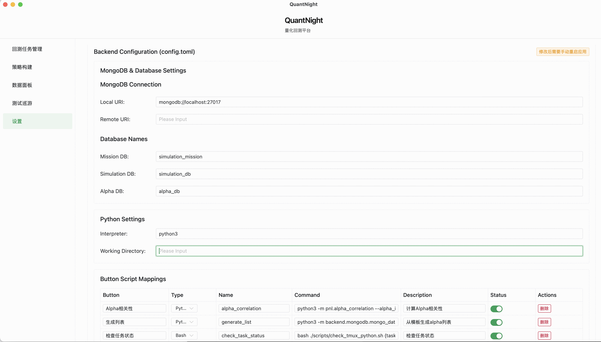

# QuantNight Task Manager

[中文](./README.md)


[](https://vuejs.org/)
[](https://tauri.app/)


QuantNight is a desktop application designed for quantitative research and simulation, aimed at helping you efficiently manage, execute, and analyze various quantitative tasks.

---

## Core Features

- **Unified Task Management**: View all normal, priority, and super tasks in one clear interface.
- **Flexible Task Creation**: Quickly create new tasks from templates, with support for local or remote execution.
- **Convenient Task Operations**: Start, pause, update, or delete tasks with a single click.
- **Data Visualization and Analysis**: Built-in data browser with support for filtering, sorting, and correlation analysis of result sets.
- **Graphical Application Configuration**: Easily manage all key frontend and backend configurations through the settings interface, no manual file editing required.

---

## First-Time Use and Configuration

Before you begin, please ensure your environment is configured correctly.

### 1. Environment Setup

- **MongoDB Database**: The application needs to connect to a running MongoDB instance. Please ensure the following three databases have been created in the instance:
  1.  `simulation_mission`
  2.  `simulation_db`
  3.  `alpha_db`
- **Create `tasks` Collection**: In the `simulation_mission` database, you **must** manually create an empty collection named `tasks`, otherwise the application will not start correctly.



### 2. Configuration Management

The application provides a complete graphical configuration interface, so you don't need to edit any configuration files manually. On first launch, the application will automatically create the necessary configuration files.

- **All configurations can be done through the UI**:
  - Frontend settings (template paths, data filter options, etc.)
  - Backend settings (MongoDB connection, Python interpreter path, etc.)
  - Script mappings

- **Configuration File Locations**:
  - User data directory (used with priority)
  - Application resource directory (as a fallback)

> **Tip**: After modifying configurations through the UI, frontend settings take effect immediately, while backend settings require an application restart to take effect.

---

## User Guide

### Task Manager

This is the main interface of the application, where you can see a list of all created tasks.

- **View Tasks**: The list displays task names, types, statuses, and other information.
- **Operate Tasks**: Each task card provides common action buttons like `Start` / `Pause` / `Delete`.

### Creating a New Task

Click the `+ Add Task` button in the upper right corner to choose from three different types of tasks to create:

- **Add Task**: Create a regular quantitative task.
- **Add Super Task**: Create a super task, typically for executing more complex combinations or workflows.
- **Add Priority Task**: Create a high-priority task.

In the pop-up window, you will need to fill in the task name and select a suitable template file to generate the task.

### Data Analysis (Data)

Switch to the `Data` page to conduct in-depth analysis of the results produced by the tasks.

- **Select Result Set**: Choose the dataset you want to analyze (e.g., `alpha_results`) from the dropdown menu at the top.
- **Use Filters**: Utilize the filter boxes at the top (such as ID, Region, Turnover, etc.) to precisely filter the data.
- **Calculate Correlation**: After filtering the data you are interested in, click the `Calculate Correlation` button, and the application will perform a correlation analysis on the results.

### Application Settings (Settings)

Click the gear icon `⚙️` in the upper right corner to open the settings panel. Here, you can conveniently modify all application settings:

- **Frontend Settings**:
  - **Template Paths**: Set the folder paths for the template files used to create different types of tasks.
  - **Data Filter Options**: Customize the options in the result set dropdown menu on the "Data Analysis" page.

- **Backend Settings**:
  - **MongoDB Settings**: Configure local and remote database connection strings and database names.
  - **Python Settings**: Set the Python interpreter path and working directory.
  - **Script Mapping**: Manage the mapping between buttons and backend scripts, with support for adding custom scripts.

> **Note**: Backend configuration changes require an application restart to take effect.

---

## Application Installation

### macOS

1.  **Download**: Go to the project's Releases page to download the latest `.dmg` file.
2.  **Install**: Open the `.dmg` file and drag `QuantNight.app` into the `Applications` folder.
3.  **Security Warning**: If macOS shows a "app is damaged" or "can't be opened" warning on first launch, execute the following command in the terminal, and you will be able to open it normally:
    ```bash
    sudo xattr -r -d com.apple.quarantine /Applications/QuantNight.app
    ```

### Windows

1.  **Download**: Go to the project's Releases page to download the latest `.msi` installer.
2.  **Install**: Double-click the `.msi` file and follow the wizard to complete the installation.
3.  **Security Warning**: On first run, if Windows SmartScreen displays a blocking message, click `More info` -> `Run anyway`.

---


