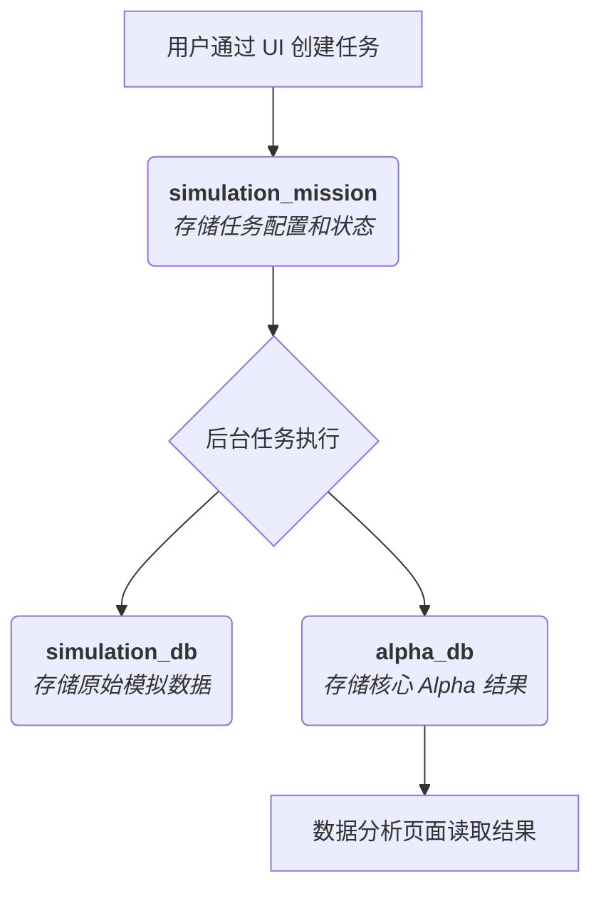

# QuantNight 量化任务管理器

QuantNight 是一款专为量化研究与模拟设计的桌面应用，旨在帮助您高效地管理、执行和分析各类量化任务。

<!-- 在此处可以放置一张应用的截图 -->
<!--  -->

---

## 核心功能

- **统一的任务管理**：在一个清晰的界面中查看所有普通、优先和超级任务。
- **灵活的任务创建**：通过模板快速创建新任务，支持本地或远程执行。
- **便捷的任务操作**：一键启动、暂停、更新或删除任务。
- **数据可视化与分析**：内置数据浏览器，支持对结果集进行筛选、排序和关联性分析。
- **图形化应用配置**：通过设置界面，轻松管理前后端的所有关键配置，无需手动修改文件。

---

## 首次使用与配置

在开始使用前，请确保您的环境已正确配置。

### 1. 环境准备

- **MongoDB 数据库**: 应用需要连接到一个正在运行的 MongoDB 实例。请确保实例中已创建了以下三个数据库：
  1.  `simulation_mission`
  2.  `simulation_db`
  3.  `alpha_db`
- **创建 `tasks` 集合**: 在 `simulation_mission` 数据库中，您**必须**手动创建一个名为 `tasks` 的空集合，否则应用将无法正常启动。



### 2. 配置管理

应用提供了完整的图形化配置界面，您无需手动编辑任何配置文件。首次启动时，应用会自动创建必要的配置文件。

- **所有配置均可通过界面完成**：
  - 前端配置（模板路径、数据筛选选项等）
  - 后端配置（MongoDB 连接、Python 解释器路径等）
  - 脚本映射配置

- **配置文件位置**：
  - 用户数据目录（优先使用）
  - 应用资源目录（作为回退）

> **提示**: 通过界面修改配置后，前端配置会立即生效，后端配置需要重启应用才能生效。

---

## 使用指南

### 任务管理器 (Task Manager)

这是应用的主界面，您可以在这里看到所有已创建的任务列表。

- **查看任务**: 列表会显示任务的名称、类型、状态等信息。
- **操作任务**: 每个任务卡片上都提供了 `启动` / `暂停` / `删除` 等常用操作按钮。

### 创建新任务

点击界面右上角的 `+ Add Task` 按钮，可以选择创建三种不同类型的任务：

- **Add Task**: 创建一个常规的量化任务。
- **Add Super Task**: 创建一个超级任务，通常用于执行更复杂的组合或流程。
- **Add Priority Task**: 创建一个高优先级的任务。

在弹出的窗口中，您需要填写任务名称并选择一个合适的模板文件来生成任务。

### 数据分析 (Data)

切换到 `Data` 页面，可以对任务产生的结果进行深入分析。

- **选择结果集**: 在顶部的下拉菜单中选择您想分析的数据集合（例如 `alpha_results`）。
- **使用筛选器**: 利用上方的多个筛选框（如 ID, Region, Turnover 等）来精确地过滤数据。
- **计算相关性**: 在筛选出您关心的数据后，点击 `计算 Correlation` 按钮，应用将对结果进行关联性分析。

### 应用设置 (Settings)

点击界面右上角的齿轮图标 `⚙️` 可以打开设置面板。在这里，您可以方便地修改所有应用配置：

- **前端配置**:
  - **Template Paths**: 设置用于创建不同类型任务的模板文件所在的文件夹路径。
  - **Data Filter Options**: 自定义"数据分析"页面中结果集下拉菜单的选项。

- **后端配置**:
  - **MongoDB 设置**: 配置本地和远程数据库连接字符串，以及数据库名称。
  - **Python 设置**: 设置 Python 解释器路径和工作目录。
  - **脚本映射**: 管理按钮与后端脚本的映射关系，支持添加自定义脚本。

> **注意**: 修改后端配置后需要重启应用才能生效。

---

## 应用安装

### macOS

1.  **下载**: 前往项目的 Releases 页面下载最新的 `.dmg` 文件。
2.  **安装**: 打开 `.dmg` 文件，将 `QuantNight.app` 拖入 `Applications` 文件夹。
3.  **安全提示**: 首次打开时，如果 macOS 提示“应用已损坏”或“无法打开”，请在终端中执行以下命令，然后即可正常打开：
    ```bash
    sudo xattr -r -d com.apple.quarantine /Applications/QuantNight.app
    ```

### Windows

1.  **下载**: 前往项目的 Releases 页面下载最新的 `.msi` 安装包。
2.  **安装**: 双击 `.msi` 文件，按照向导完成安装。
3.  **安全提示**: 首次运行时，如果 Windows SmartScreen 弹出拦截提示，请点击 `更多信息` -> `仍要运行`。
