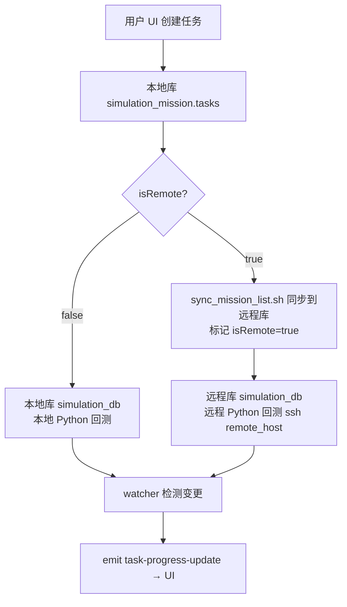

# QuantNight 量化任务管理器

[English](./README.en.md)


[](https://vuejs.org/)
[](https://tauri.app/)


QuantNight 是一款专为量化研究与模拟设计的桌面应用，旨在帮助您高效地管理、执行和分析各类量化任务。

---

## 核心功能

- **统一的任务管理**：在一个清晰的界面中查看所有普通、优先和超级任务。
- **灵活的任务创建**：通过模板快速创建新任务，支持本地或远程执行。
- **便捷的任务操作**：一键启动、暂停、更新或删除任务。
- **数据可视化与分析**：内置数据浏览器，支持对结果集进行筛选、排序和关联性分析。
- **图形化应用配置**：通过设置界面，轻松管理前后端的所有关键配置，无需手动修改文件。

---

## 系统架构

> ⚠️ **对开发者/Agent 最重要的一节**。量化回测是**状态驱动**的分布式系统：UI 与执行解耦，数据跨库流动。**"本地/远程"不是固定的机器，而是由设置（Settings）配置出来的概念**——任何部署形态（单机、双机、异地）都通过配置表达，不要硬编码任何机器名/路径。

### 1. 配置驱动的"本地/远程"模型

| 配置项 | 位置 | 含义 |
|---|---|---|
| `mongodb.local_uri` | Settings / config.toml | 本地库连接（默认 `mongodb://localhost:27017`）|
| `mongodb.remote_uri` | Settings / config.toml | 远程库连接（如 `mongodb://192.168.1.100:27017` = 执行机）|
| `env.working_dir` | Settings / config.toml | 后端 Python 脚本的工作目录 |
| `scripts.local_workdir` | credentials.yaml | 本地工作目录 |
| `scripts.remote_host` / `remote_workdir` | credentials.yaml | 远程执行主机与目录 |

- 单机部署：`remote_uri` 指向本机或留空，`isRemote` 永远 false。
- 双机部署（推荐）：桌面端负责 UI/任务管理，执行机（如 mac-mini）跑 Python 回测，`remote_uri` / `remote_host` 指向它。

### 2. 双数据库模型

应用同时持有**本地**与**远程**两个 MongoDB 客户端（`MongoClients { local, remote }`），按任务 `isRemote` 字段分流：

| 数据库 | 内容 | 读写位置 |
|---|---|---|
| `simulation_mission.tasks` | 任务配置与状态（**唯一权威来源**）| **永远在本地库** |
| `simulation_db.<task>` | 模拟 item 数据（settings/regular/feat/结果）| 按 `isRemote` 分流：本地库 或 远程库 |
| `alpha_db` | 核心 Alpha 结果 / PnL / 平台数据 | 本地库 |

### 3. 任务数据流



1. **创建任务** → 写本地库 `simulation_mission.tasks`（前端任务列表从这里读）。
2. **生成列表** → 本地运行 `mongo_datum`（模板生成 item 到 `simulation_db.<task>`，**始终先写在本地库**）。
3. **发送到远程**（可选，isRemote 任务）→ `sync_mission_list.sh` 把 `simulation_db.<task>` 推到 `remote_uri`，并标记 `isRemote=true`。
4. **启动任务** → `start_task.sh <name> <config> <isRemote>`：
   - `isRemote=false`：本地启动 Python。
   - `isRemote=true`：通过 SSH 在 `remote_host` 启动 Python（读远程库）。
5. **回测执行** → Python 读取对应库的 item → 提交 WQB 模拟 → 结果写回同库。
6. **进度推送** → 前端 `watcher` 用 ChangeStream 监听**本地+远程**两个 `simulation_db`，变更时按任务的 `isRemote` 选库统计，`emit("task-progress-update")` 推给 UI。

### 4. 前端数据来源速查（agent 排查问题用）

| UI 内容 | 命令 / 机制 | 读取库 |
|---|---|---|
| 任务列表 / 状态 | `get_all_tasks` | 本地库 `simulation_mission.tasks` |
| 任务卡片 ✓/✗/Σ 进度 | `watcher.rs` ChangeStream + `emit_progress_for_collection` | **按 isRemote 分流**：true→远程库，false→本地库 |
| 数据分析（Data 页）| `datas.rs` 各查询 | 本地库 `simulation_db` / `alpha_db` |
| isRemote 开关 | `update_remote_status` | 更新本地库 tasks 文档 |

### 5. isRemote 字段语义

- `false`（本地）：数据在本地库，Python 在本地执行。
- `true`（远程）：数据已同步到远程库，Python 在远程执行（SSH）。
- ⚠️ 切换/标记 `isRemote` 只改任务文档字段，**不会自动搬数据**——必须先 `sync_mission_list.sh` 同步数据再标记。

### 6. 脚本执行模型

前端按钮 → Tauri `invoke` 命令 → `run_bash_script` / `run_python_command`（按 `python.scripts` / `bash.scripts` 映射）→ 本地执行 shell/uv，或 SSH 到 `remote_host` 执行。**任务执行逻辑在后端仓库（quantnight），不在本仓库。**

---

## 首次使用与配置

在开始使用前，请确保您的环境已正确配置。

### 1. 环境准备

- **MongoDB 数据库**: 应用需要连接到一个正在运行的 MongoDB 实例。请确保实例中已创建了以下三个数据库：
  1.  `simulation_mission`
  2.  `simulation_db`
  3.  `alpha_db`
- **创建 `tasks` 集合**: 在 `simulation_mission` 数据库中，您**必须**手动创建一个名为 `tasks` 的空集合，否则应用将无法正常启动。

### 2. 配置管理

应用提供了完整的图形化配置界面，您无需手动编辑任何配置文件。首次启动时，应用会自动创建必要的配置文件。

- **所有配置均可通过界面完成**：
  - 前端配置（模板路径、数据筛选选项等）
  - 后端配置（MongoDB 连接、Python 解释器路径等）
  - 脚本映射配置

- **配置文件位置**：
  - 用户数据目录（优先使用）
  - 应用资源目录（作为回退）

> **提示**: 通过界面修改配置后，前端配置会立即生效，后端配置需要重启应用才能生效。

---

## 使用指南

### 任务管理器 (Task Manager)

这是应用的主界面，您可以在这里看到所有已创建的任务列表。

- **查看任务**: 列表会显示任务的名称、类型、状态等信息。
- **操作任务**: 每个任务卡片上都提供了 `启动` / `暂停` / `删除` 等常用操作按钮。
- **任务卡片进度**: 卡片显示 `✓ 成功 | ✗ 失败 | Σ 总计`（格式为 `普通数+插队数`）。进度由 watcher 实时推送，isRemote 任务显示的是**远程库**的状态。

### 创建新任务

点击界面右上角的 `+ Add Task` 按钮，可以选择创建三种不同类型的任务：

- **Add Task**: 创建一个常规的量化任务。
- **Add Super Task**: 创建一个超级任务，通常用于执行更复杂的组合或流程。
- **Add Priority Task**: 创建一个高优先级的任务。

在弹出的窗口中，您需要填写任务名称并选择一个合适的模板文件来生成任务。启动时可在"配置 JSON"中设置任务参数（如 `adaptive` 自适应调度配置）。

### 数据分析 (Data)

切换到 `Data` 页面，可以对任务产生的结果进行深入分析。

- **选择结果集**: 在顶部的下拉菜单中选择您想分析的数据集合（例如 `alpha_results`）。
- **使用筛选器**: 利用上方的多个筛选框（如 ID, Region, Turnover 等）来精确地过滤数据。
- **计算相关性**: 在筛选出您关心的数据后，点击 `计算 Correlation` 按钮，应用将对结果进行关联性分析。

### 应用设置 (Settings)

点击界面右上角的齿轮图标 `⚙️` 可以打开设置面板。在这里，您可以方便地修改所有应用配置：

- **前端配置**:
  - **Template Paths**: 设置用于创建不同类型任务的模板文件所在的文件夹路径。
  - **Data Filter Options**: 自定义"数据分析"页面中结果集下拉菜单的选项。

- **后端配置**:
  - **MongoDB 设置**: 配置本地和远程数据库连接字符串（`local_uri` / `remote_uri`），以及数据库名称。
  - **Python 设置**: 设置 Python 解释器路径和工作目录。
  - **脚本映射**: 管理按钮与后端脚本的映射关系，支持添加自定义脚本。

> **注意**: 修改后端配置后需要重启应用才能生效。

---

## 应用安装

### macOS

1.  **下载**: 前往项目的 Releases 页面下载最新的 `.dmg` 文件。
2.  **安装**: 打开 `.dmg` 文件，将 `QuantNight.app` 拖入 `Applications` 文件夹。
3.  **安全提示**: 首次打开时，如果 macOS 提示“应用已损坏”或“无法打开”，请在终端中执行以下命令，然后即可正常打开：
    ```bash
    sudo xattr -r -d com.apple.quarantine /Applications/QuantNight.app
    ```

### Windows

1.  **下载**: 前往项目的 Releases 页面下载最新的 `.msi` 安装包。
2.  **安装**: 双击 `.msi` 文件，按照向导完成安装。
3.  **安全提示**: 首次运行时，如果 Windows SmartScreen 弹出拦截提示，请点击 `更多信息` -> `仍要运行`。
