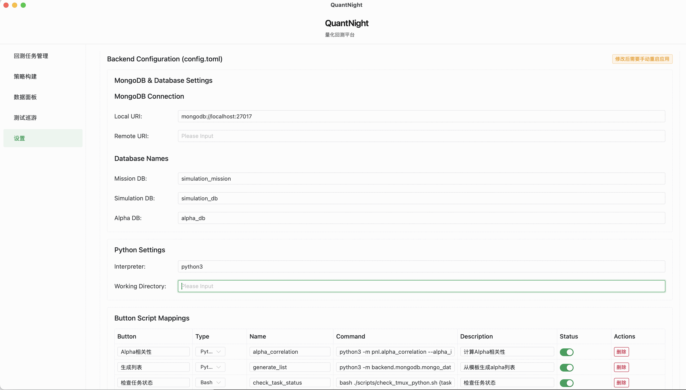

# QuantNight

[English](README.en.md) · [下载安装包](https://github.com/roshameow/quantnight-frontend/releases/latest) · [使用指南](docs/user-guide.zh.md)

量化研究任务的桌面控制台：管理普通、Priority 和 Super 任务，查看本地与远程执行进度，筛选研究结果。



## 先体验

无需数据库、平台账号或私有后端，即可运行使用合成数据的交互演示：

```bash
git clone https://github.com/roshameow/quantnight-frontend.git
cd quantnight-frontend
npm ci
npm run demo
```

打开终端给出的地址，在 `/demo.html` 查看任务卡片、切换本地/远程标记、筛选示例结果。演示中的启动、暂停、删除仅修改内存数据，刷新后重置；不会提交模拟任务。需要 Node.js 22 或更新版本。

## 这个仓库包含什么

| 内容 | 可用范围 |
| --- | --- |
| Vue + Tauri 桌面界面 | 本仓库公开源码，可自行构建 |
| 任务展示、配置界面、结果浏览 | 桌面运行需要配置 MongoDB；演示无需 MongoDB |
| 回测执行、任务生成与远程调度脚本 | 属于独立的私有 `quantnight` 后端，未包含在本仓库 |

下载安装包并不包含执行后端。完整研究工作流需要已有的兼容后端、脚本映射和相应平台账号。演示数据是虚构数据，不代表实际回测表现。

## 桌面安装与开发

从 [Releases](https://github.com/roshameow/quantnight-frontend/releases/latest) 下载 macOS 或 Windows 安装包，按[首次配置指南](docs/user-guide.zh.md)连接自己的环境。

```bash
npm ci
npm run tauri:dev
```

源码构建还需要 Rust 和 [Tauri 系统依赖](https://v2.tauri.app/start/prerequisites/)。先用演示检查界面，再配置完整桌面环境。

## 文档

- [用户指南](docs/user-guide.zh.md)：数据库准备、设置、任务与数据页面。
- [系统架构](docs/architecture.zh.md)：本地/远程语义、数据流、脚本执行边界。
- [版本记录](CHANGELOG.md)：源码与安装包版本说明。
- [问题反馈](https://github.com/roshameow/quantnight-frontend/issues)：请附版本、系统、复现步骤及脱敏日志。

## 版本与许可

当前源码版本为 **1.2.4**；可下载版本以 Releases 为准。历史 `v1.2.3` 安装包曾使用 `0.1.0` 文件名，详情见版本记录。

[MIT](LICENSE)
