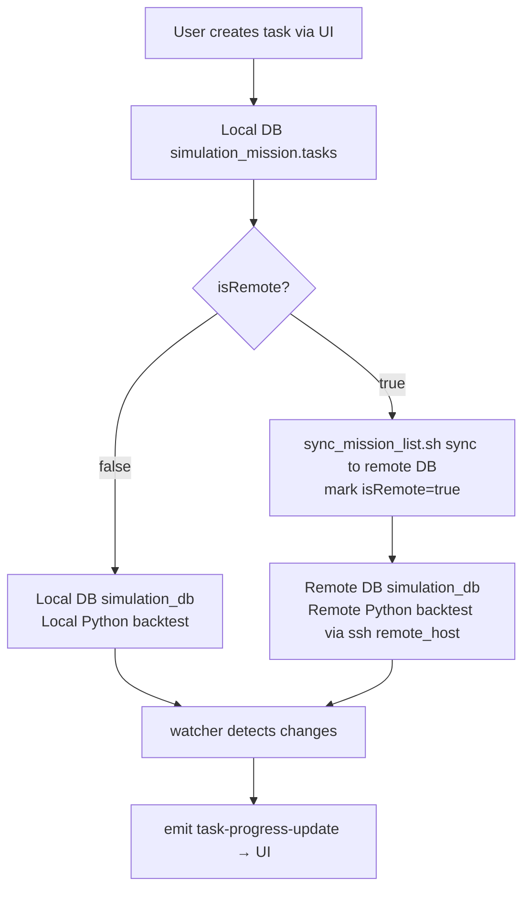

## System Architecture

> ⚠️ **The most important section for developers/agents.** Quantitative backtesting is a **state-driven distributed system**: the UI is decoupled from execution, and data flows across databases. **"Local/Remote" is NOT a fixed machine — it is a concept configured through Settings.** Any deployment shape (single machine, dual machine, remote) is expressed via configuration. Never hardcode machine names or paths.

### 1. Configuration-Driven "Local/Remote" Model

| Config Key | Location | Meaning |
|---|---|---|
| `mongodb.local_uri` | Settings / config.toml | Local DB URI (default `mongodb://localhost:27017`) |
| `mongodb.remote_uri` | Settings / config.toml | Remote DB URI (via SSH tunnel, e.g. `mongodb://127.0.0.1:27018/?directConnection=true` = mac-mini execution machine) |
| `env.working_dir` | Settings / config.toml | Working directory for backend Python scripts |
| `scripts.local_workdir` | credentials.yaml | Local working directory |
| `scripts.remote_host` / `remote_workdir` | credentials.yaml | Remote execution host and directory |

- Single-machine: `remote_uri` points to the local host or empty; `isRemote` stays `false`.
- Dual-machine (recommended): the desktop app handles UI/task management; an execution machine (e.g. mac-mini) runs Python backtests; `remote_uri` / `remote_host` point to it.

### 2. Dual-Database Model

The app holds **local** and **remote** MongoDB clients simultaneously (`MongoClients { local, remote }`), dispatching by each task's `isRemote` field:

| Database | Content | Read/Write Location |
|---|---|---|
| `simulation_mission.tasks` | Task config & status (**single source of truth**) | **Always local DB** |
| `simulation_db.<task>` | Simulation items (settings/regular/feat/results) | Dispatched by `isRemote`: local or remote DB |
| `alpha_db` | Core alpha results / PnL / platform data | Local DB |

### 3. Task Data Flow

1. **Create task** → write local `simulation_mission.tasks` (frontend task list reads from here).
2. **Generate list** → run `mongo_datum` locally (template generates items into `simulation_db.<task>`, **always written to the local DB first**).
3. **Send to remote** (optional, for isRemote tasks) → `sync_mission_list.sh` pushes `simulation_db.<task>` to `remote_uri`, then mark `isRemote=true`.
4. **Start task** → `start_task.sh <name> <config> <isRemote>`:
   - `isRemote=false`: start Python locally.
   - `isRemote=true`: start Python on `remote_host` via SSH (reads remote DB).
5. **Backtest execution** → Python reads items from the corresponding DB → submits WQB simulations → writes results back to the same DB.
6. **Progress push** → the frontend `watcher` listens to changes on **both** `simulation_db` (local + remote) via ChangeStream, picks the DB by the task's `isRemote`, and `emit("task-progress-update")` to the UI.

### 4. Frontend Data Source Cheat-Sheet (for agents debugging)

| UI Content | Command / Mechanism | DB Read |
|---|---|---|
| Task list / status | `get_all_tasks` | Local `simulation_mission.tasks` |
| Task card ✓/✗/Σ progress | `watcher.rs` ChangeStream + `emit_progress_for_collection` | **Dispatched by isRemote**: true→remote, false→local |
| Data analysis (Data page) | `datas.rs` queries | Local `simulation_db` / `alpha_db` |
| isRemote toggle | `update_remote_status` | Updates local tasks doc |

### 5. `isRemote` Semantics

- `false` (local): data in local DB; Python executes locally.
- `true` (remote): data synced to remote DB; Python executes remotely (SSH).
- ⚠️ Toggling `isRemote` only changes the task doc field — it does **NOT** move data automatically. You must run `sync_mission_list.sh` first, then mark `isRemote`.

### 6. Script Execution Model

UI button → Tauri `invoke` command → `run_bash_script` / `run_python_command` (mapped by `python.scripts` / `bash.scripts`) → execute shell/uv locally, or via SSH to `remote_host`. **Task execution logic lives in the backend repo (quantnight), not in this repo.**
