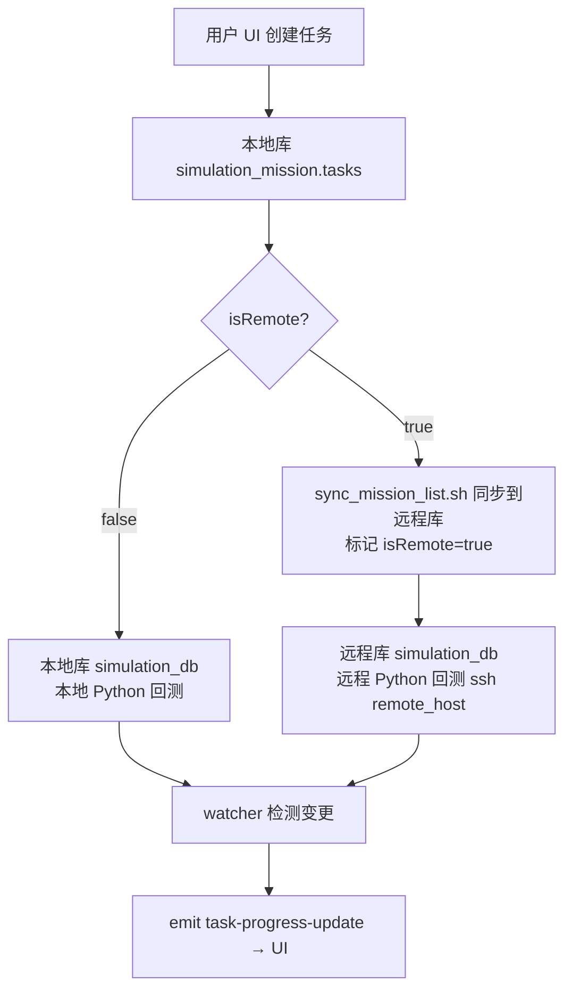

## 系统架构

> ⚠️ **对开发者/Agent 最重要的一节**。量化回测是**状态驱动**的分布式系统：UI 与执行解耦，数据跨库流动。**"本地/远程"不是固定的机器，而是由设置（Settings）配置出来的概念**——任何部署形态（单机、双机、异地）都通过配置表达，不要硬编码任何机器名/路径。

### 1. 配置驱动的"本地/远程"模型

| 配置项 | 位置 | 含义 |
|---|---|---|
| `mongodb.local_uri` | Settings / config.toml | 本地库连接（默认 `mongodb://localhost:27017`）|
| `mongodb.remote_uri` | Settings / config.toml | 远程库连接（经 SSH 隧道，如 `mongodb://127.0.0.1:27018/?directConnection=true` = mac-mini 执行机）|
| `env.working_dir` | Settings / config.toml | 后端 Python 脚本的工作目录 |
| `scripts.local_workdir` | credentials.yaml | 本地工作目录 |
| `scripts.remote_host` / `remote_workdir` | credentials.yaml | 远程执行主机与目录 |

- 单机部署：`remote_uri` 指向本机或留空，`isRemote` 永远 false。
- 双机部署（推荐）：桌面端负责 UI/任务管理，执行机（如 mac-mini）跑 Python 回测，`remote_uri` / `remote_host` 指向它。

### 2. 双数据库模型

应用同时持有**本地**与**远程**两个 MongoDB 客户端（`MongoClients { local, remote }`），按任务 `isRemote` 字段分流：

| 数据库 | 内容 | 读写位置 |
|---|---|---|
| `simulation_mission.tasks` | 任务配置与状态（**唯一权威来源**）| **永远在本地库** |
| `simulation_db.<task>` | 模拟 item 数据（settings/regular/feat/结果）| 按 `isRemote` 分流：本地库 或 远程库 |
| `alpha_db` | 核心 Alpha 结果 / PnL / 平台数据 | 本地库 |

### 3. 任务数据流

1. **创建任务** → 写本地库 `simulation_mission.tasks`（前端任务列表从这里读）。
2. **生成列表** → 本地运行 `mongo_datum`（模板生成 item 到 `simulation_db.<task>`，**始终先写在本地库**）。
3. **发送到远程**（可选，isRemote 任务）→ `sync_mission_list.sh` 把 `simulation_db.<task>` 推到 `remote_uri`，并标记 `isRemote=true`。
4. **启动任务** → `start_task.sh <name> <config> <isRemote>`：
   - `isRemote=false`：本地启动 Python。
   - `isRemote=true`：通过 SSH 在 `remote_host` 启动 Python（读远程库）。
5. **回测执行** → Python 读取对应库的 item → 提交 WQB 模拟 → 结果写回同库。
6. **进度推送** → 前端 `watcher` 用 ChangeStream 监听**本地+远程**两个 `simulation_db`，变更时按任务的 `isRemote` 选库统计，`emit("task-progress-update")` 推给 UI。

### 4. 前端数据来源速查（agent 排查问题用）

| UI 内容 | 命令 / 机制 | 读取库 |
|---|---|---|
| 任务列表 / 状态 | `get_all_tasks` | 本地库 `simulation_mission.tasks` |
| 任务卡片 ✓/✗/Σ 进度 | `watcher.rs` ChangeStream + `emit_progress_for_collection` | **按 isRemote 分流**：true→远程库，false→本地库 |
| 数据分析（Data 页）| `datas.rs` 各查询 | 本地库 `simulation_db` / `alpha_db` |
| isRemote 开关 | `update_remote_status` | 更新本地库 tasks 文档 |

### 5. isRemote 字段语义

- `false`（本地）：数据在本地库，Python 在本地执行。
- `true`（远程）：数据已同步到远程库，Python 在远程执行（SSH）。
- ⚠️ 切换/标记 `isRemote` 只改任务文档字段，**不会自动搬数据**——必须先 `sync_mission_list.sh` 同步数据再标记。

### 6. 脚本执行模型

前端按钮 → Tauri `invoke` 命令 → `run_bash_script` / `run_python_command`（按 `python.scripts` / `bash.scripts` 映射）→ 本地执行 shell/uv，或 SSH 到 `remote_host` 执行。**任务执行逻辑在后端仓库（quantnight），不在本仓库。**
